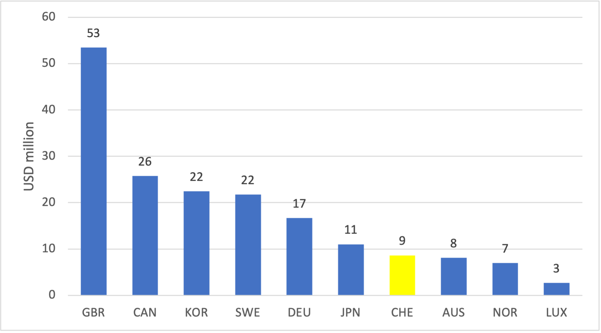
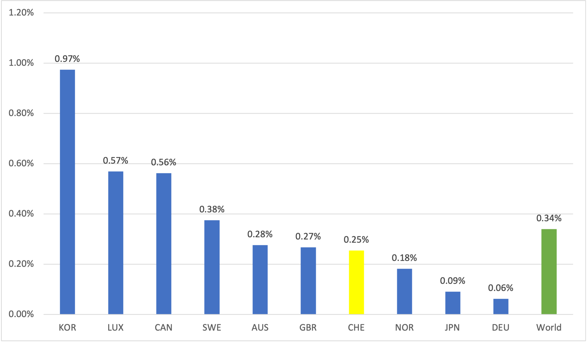

--- 
title: "Switzerland's Support to Data and Statistics - Facts and Summary"
date: "December 2022"
description: "Factsheet on Switzerland's support to data and statistics"
site: bookdown::bookdown_site
favicon: CH_circle.ico
---


# Overview on Switzerland's Support for Data and Statistics

In 2017-2020, Switzerland provided around USD 9 million per year to data and statistical development. 

During the same period, UK, Canada, South Korea and Sweden spent USD 53 million, USD 26 million, USD 22 million and USD 22 million, respectively.

```{r genseries, echo = FALSE, message = F, fig.cap = 'Average annual funding for data and statistics (2017-2020)', out.width = '60%', fig.align = 'center'}

source("code/00. boot.R")



```

USD 9 million accounts for 0.25% of Switzerland’s annual Official Development Assistance (ODA), lower than the global average of 0.34%.

UK, Canada, South Korea and Sweden also allocated a higher share of their ODA to data and statistics than Switzerland did. 


```{r share, echo = FALSE, message = F, fig.cap = 'Share of total ODA for data and statistics (2017-2020)', out.width = '75%', fig.align = 'center'}



```
